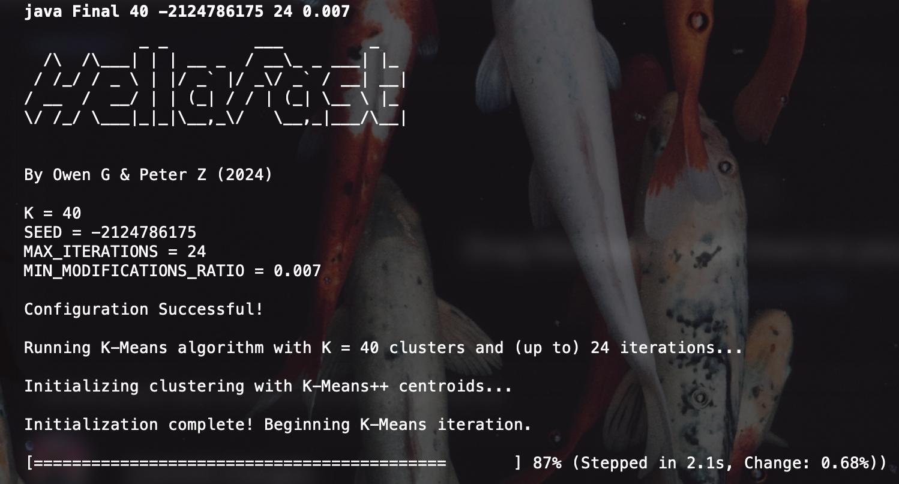
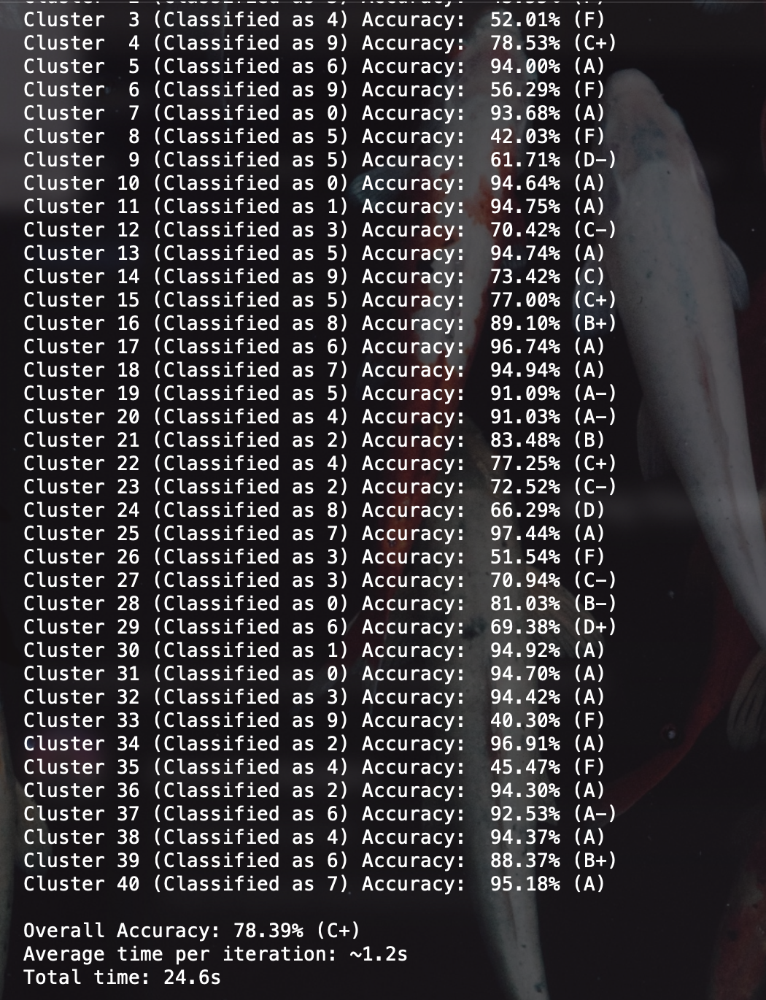

# HellaFast
A K-Means algorithm implementation involving various optimization techniques. Used to group MNIST dataset of hand-written numbers 0-9.

Made for me and my friend's Java Algorithms class as the Final project. Our program was both the fastest and most accurate in the class.

A short outline of the optimizations we performed:
---

#### **1. Parallel Processing with Java Streams**
- **Usage of `IntStream.range().parallel()` for Parallelism:**  
  The program leverages the `parallel()` method on Java Streams to distribute computations across multiple CPU cores, thus speeding up execution. This is used in multiple places, such as during the initialization of the distance matrix, nearest centroid calculation, and centroid computation.

- **Benefit:**  
  Parallel streams allow the operations to be executed concurrently, reducing the overall execution time significantly, especially in a multi-core processor environment.

---

#### **2. Efficient Distance Matrix Initialization**
- **Precomputation of Distances:**  
  The distance between each item and each centroid is precomputed and stored in a matrix (`distanceMatrix`) before the main iteration loop begins. This avoids recalculating distances multiple times during the nearest centroid determination step.

- **Benefit:**  
  Reduces redundant calculations during the iteration process, leading to faster convergence.

---

#### **3. Nearest Centroid Calculation Optimization**
- **Minimization Using `IntStream.parallel()` and `Comparator`:**  
  The nearest centroid is found by streaming through the precomputed distance matrix using `IntStream.parallel()` combined with a `Comparator`. This approach minimizes the distance comparison time by leveraging parallelism.

- **Benefit:**  
  Speeds up the process of finding the nearest centroid for each item, which is critical as it is a frequent operation in the K-Means algorithm.

---

#### **4. Dynamic Weighting of Centroid Updates**
- **Weighted Centroid Update:**  
  The centroids are updated using a weighted average of the old centroid and the newly computed centroid. The weight assigned to the new centroid decreases as iterations progress, calculated as `weightNewCentroid = 0.4 - (0.3 * (iterations / (double) MAX_ITERATIONS))`.

- **Benefit:**  
  This approach smooths the updates to the centroid, preventing large fluctuations and potentially leading to faster convergence by stabilizing the centroids over time.

---

#### **5. Early Convergence Check**
- **Early Termination Based on Modification Ratio:**  
  The algorithm monitors the ratio of modifications (i.e., changes in cluster assignments) in each iteration and terminates early if the ratio drops below a specified threshold (`MIN_MODIFICATIONS_RATIO`).

- **Benefit:**  
  Avoids unnecessary iterations once the clusters have stabilized, saving computational resources and time.

---

#### **6. K-Means++ Initialization**
- **Improved Initialization of Centroids:**  
  The algorithm uses the K-Means++ initialization method, which spreads out the initial centroids more evenly by selecting the first centroid randomly and then each subsequent centroid based on a weighted probability proportional to its distance from the nearest already chosen centroid.

- **Benefit:**  
  This initialization generally leads to better clustering results and faster convergence compared to random initialization.

---

#### **7. Concurrent Cluster Assignment Storage**
- **Use of `ConcurrentLinkedQueue` for Cluster Storage:**  
  Each cluster is stored in a `ConcurrentLinkedQueue`, which allows safe concurrent modifications by multiple threads during the parallel processing phase.

- **Benefit:**  
  Ensures thread-safe operations when clusters are being populated in parallel, avoiding potential race conditions.

---

#### **8. ExecutorService for Background Tasks**
- **Asynchronous File Export with `ExecutorService`:**  
  The program uses an `ExecutorService` to handle background tasks such as exporting images and labels to files. This allows the main K-Means algorithm to continue processing without being blocked by I/O operations.

- **Benefit:**  
  Improves the responsiveness of the application, particularly in scenarios where I/O operations could be slow.

---

#### **9. Preprocessing and Postprocessing Optimizations**
- **Parallel Image Preprocessing and Postprocessing:**  
  Both the preprocessing (`preprocessImages`) and postprocessing (`postProcessImages`) of images are executed in parallel. These steps include noise reduction, contrast enhancement, Gaussian blur, and sharpening.

- **Benefit:**  
  Accelerates these computationally intensive tasks by distributing the workload across multiple threads.

---

#### **10. Progress Monitoring and Dynamic Feedback**
- **Real-time Progress Bar with Iteration Timing:**  
  The algorithm includes a real-time progress bar that provides dynamic feedback on the percentage of completion, the time taken for the last iteration, and the change percentage in cluster assignments.

- **Benefit:**  
  This feature does not directly optimize the algorithm but enhances user experience by providing insight into the algorithm's progress, allowing for better monitoring and potential adjustments if necessary.

---

### Conclusion
The program implements multiple optimizations that focus on maximizing parallel execution, reducing redundant calculations, and managing resources efficiently. These strategies are designed to enhance the performance and scalability of the K-Means algorithm, particularly when dealing with large datasets or computationally expensive operations like distance calculations and centroid updates.

